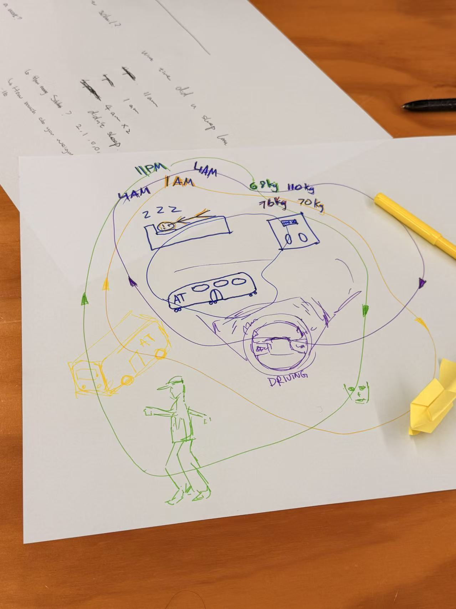

# Week 001

[← Back to Home](../index.md)

## Documentation 

*Include your documentation for the week. Devise your own structure of headings relevant to the required tasks and your process.*

## Images & Media

*Use the format below to embed images from your assets folder:*

*Your caption here*
[Watch the video]
*The text inside the square brackets is alt text (a description for accessibility), not a visible caption. To add a caption, place a line of italic text below the image.*

[Watch the video](https://www.youtube.com/watch?v=H5awS-QBPHk)
<iframe
  src="https://www.youtube.com/embed=H5awS-QBPHk"
  width="560" 
  height="315">
</iframe>

## AI Usage Statement

*Document any use of AI tools under an AI Usage Statement heading. Explain which tools you used and describe how you used them. Reference any AI-generated content (see [QuickCite](https://auckland.libguides.com/referencing-generative-ai-tools) for guidance).*
